# Medication Price Comparison Chatbot

## 🔄 Application Flow

```mermaid
graph TD
    A["👤 User"] -->|"Types message"| B["💻 Frontend<br/>Next.js"]
    B -->|"POST /chat"| C["⚙️ Backend<br/>FastAPI"]
    C -->|"Process query"| D{"🔍 Query Analysis"}
    D -->|"Medication query"| E["🌐 Tavily<br/>Search API"]
    D -->|"General query"| F["💬 General<br/>Response"]
    E -->|"Search web"| G["🏥 Pharmacy<br/>Sources"]
    G -->|"Extract prices"| H["📊 Process<br/>Results"]
    H -->|"Format data"| C
    F -->|"Format response"| C
    C -->|"JSON response"| B
    B -->|"Display results"| A

    subgraph "🏪 Supported Pharmacies"
        G --> P1["GoodRx"]
        G --> P2["Walgreens"]
        G --> P3["CVS"]
        G --> P4["Costco"]
        G --> P5["Walmart"]
    end
```



A modern AI-powered chatbot that helps users find the best prices for medications across different pharmacies using **Tavily's search API** and **Model Context Protocol (MCP)**.

## 🚀 Features

- **AI-Powered Chat Interface**: Natural language queries for medication price searches
- **Real-Time Price Comparison**: Uses [Tavily API](https://www.tavily.com/) to search current medication prices
- **Multiple Pharmacy Support**: Compares prices across GoodRx, Walgreens, CVS, Costco, Walmart, and more
- **Location-Based Search**: Find pharmacies and prices near you
- **Modern UI/UX**: Built with Next.js 14 and Tailwind CSS
- **MCP Integration**: Implements Model Context Protocol for standardized AI tool interactions
- **TypeScript**: Full type safety across frontend and backend

## 🏗️ Architecture

- **Frontend**: Next.js 14 with TypeScript, Tailwind CSS, and Lucide React icons
- **Backend**: Python FastAPI with Tavily integration and MCP server
- **AI Search**: Tavily API for real-time web search optimized for LLMs
- **Protocol**: Model Context Protocol (MCP) for AI-tool standardization

## 📋 Prerequisites

- Node.js 18+ and npm
- Python 3.9+
- Tavily API key (sign up at [tavily.com](https://www.tavily.com/))

## 🛠️ Installation

### 1. Clone the Repository

```bash
git clone <your-repo-url>
cd medication-price-chatbot
```

### 2. Install Dependencies

```bash
# Install root dependencies
npm install

# Install frontend dependencies
cd frontend && npm install && cd ..

# Install backend dependencies
cd backend && pip install -r requirements.txt && cd ..
```

### 3. Set Up Environment Variables

Create a `.env` file in the `backend` directory:

```bash
cd backend
cp env.example .env
```

Edit the `.env` file and add your API keys:

```env
# API Keys
TAVILY_API_KEY=your_tavily_api_key_here
OPENAI_API_KEY=your_openai_api_key_here  # Optional, for future AI features
ANTHROPIC_API_KEY=your_anthropic_api_key_here  # Optional, for future AI features

# Server Configuration
HOST=localhost
PORT=8000
DEBUG=True

# CORS
ALLOWED_ORIGINS=http://localhost:3000,http://127.0.0.1:3000

# MCP Configuration
MCP_SERVER_NAME=medication-price-server
MCP_SERVER_VERSION=1.0.0
```

### 4. Get Your Tavily API Key

1. Visit [tavily.com](https://www.tavily.com/)
2. Sign up for a free account
3. Get your API key from the dashboard
4. Add it to your `.env` file

## 🚦 Running the Application

### Development Mode

Run both frontend and backend simultaneously:

```bash
npm run dev
```

This will start:
- Backend API server at `http://localhost:8000`
- Frontend Next.js app at `http://localhost:3000`

### Individual Services

**Backend only:**
```bash
npm run dev:backend
# or
cd backend && python -m uvicorn main:app --reload --port 8000
```

**Frontend only:**
```bash
npm run dev:frontend
# or
cd frontend && npm run dev
```

## 📱 Usage

1. Open your browser and go to `http://localhost:3000`
2. (Optional) Enter your location for better local results
3. Start chatting! Try queries like:
   - "What's the price of ibuprofen?"
   - "Find cheap metformin near me"
   - "Compare insulin prices"
   - "Show me acetaminophen costs"

## 🔧 API Endpoints

### Backend API

- **GET** `/` - API status
- **POST** `/chat` - Main chat endpoint
- **POST** `/search-medication` - Direct medication search
- **GET** `/health` - Health check
- **POST** `/mcp/tools/list` - List available MCP tools
- **POST** `/mcp/tools/execute` - Execute MCP tools

### Example API Usage

```bash
# Chat with the bot
curl -X POST "http://localhost:8000/chat" \
  -H "Content-Type: application/json" \
  -d '{"message": "Find price for ibuprofen", "user_location": "New York"}'

# Direct medication search
curl -X POST "http://localhost:8000/search-medication" \
  -H "Content-Type: application/json" \
  -d '{"medication_name": "ibuprofen", "location": "New York"}'
```

## 🧠 How It Works

The application follows a streamlined process to find and compare medication prices:


1. **User Input**: User sends a message through the chat interface
2. **Intent Detection**: Backend analyzes the message for medication-related keywords
3. **Tavily Search**: If medication query detected, searches web using Tavily API
4. **Price Extraction**: Extracts price information from search results
5. **Response**: Returns formatted response with price comparisons
6. **MCP Integration**: Exposes search functionality as standardized MCP tools

## 🛡️ Model Context Protocol (MCP)

This project implements MCP to provide standardized AI-tool interactions:

- **Tools**: `search_medication_price` - Search for medication prices
- **Resources**: Real-time price data from multiple pharmacies
- **Protocol**: JSON-RPC 2.0 messaging over HTTP

### MCP Tool Usage

```json
{
  "tool_name": "search_medication_price",
  "parameters": {
    "medication_name": "ibuprofen",
    "dosage": "200mg",
    "location": "New York, NY"
  }
}
```

## 🎨 Customization

### Adding New Pharmacy Sources

Edit `backend/main.py` and update the `search_medication_prices` function:

```python
# Add new pharmacy domains to include_domains
include_domains=[
    "goodrx.com", 
    "walgreens.com", 
    "cvs.com", 
    "your-new-pharmacy.com"  # Add here
]
```

### Styling

The frontend uses Tailwind CSS. Customize colors in `frontend/tailwind.config.js`:

```javascript
theme: {
  extend: {
    colors: {
      primary: {
        50: '#eff6ff',
        500: '#3b82f6',  // Change primary color
        600: '#2563eb',
        700: '#1d4ed8',
      }
    }
  }
}
```

## 🧪 Testing

```bash
# Backend tests
cd backend && python -m pytest

# Frontend tests  
cd frontend && npm test
```

## 📦 Production Build

```bash
# Build frontend
npm run build

# Start production server
npm start
```

## 🤝 Contributing

1. Fork the repository
2. Create a feature branch (`git checkout -b feature/amazing-feature`)
3. Commit your changes (`git commit -m 'Add amazing feature'`)
4. Push to the branch (`git push origin feature/amazing-feature`)
5. Open a Pull Request

## 📄 License

This project is licensed under the MIT License - see the [LICENSE](LICENSE) file for details.

## 🙏 Acknowledgments

- [Tavily](https://www.tavily.com/) for providing the AI-optimized search API
- [Model Context Protocol](https://github.com/modelcontextprotocol) by Anthropic
- [FastAPI](https://fastapi.tiangolo.com/) for the backend framework
- [Next.js](https://nextjs.org/) for the frontend framework

## 📞 Support

If you encounter any issues:

1. Check the [Issues](../../issues) page
2. Ensure all environment variables are set correctly
3. Verify your Tavily API key is valid
4. Check that both frontend and backend servers are running

## 🔮 Future Features

- [ ] Insurance coverage integration
- [ ] Prescription discount programs
- [ ] Medication reminder system
- [ ] Multi-language support
- [ ] Mobile app version
- [ ] Advanced AI models integration (GPT-4, Claude)
- [ ] User accounts and medication history 